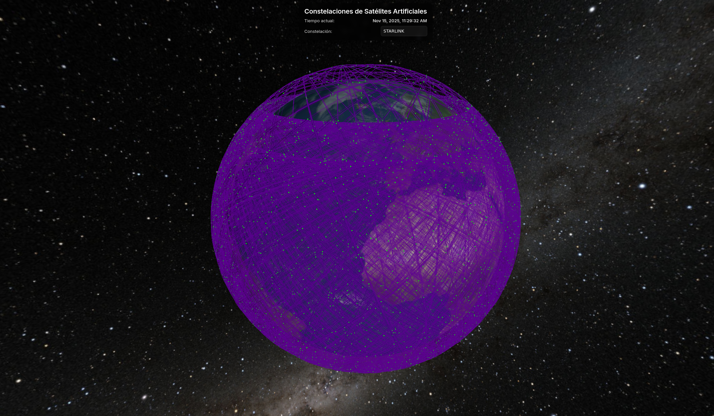

https://youtu.be/t7z74d5FqfY

https://alumnosulpgc-my.sharepoint.com/:v:/g/personal/oliver_cabrera101_alu_ulpgc_es/ERqmYx-qHDVLs3sornljqDIBd82Taq_jcP2vgsWhIa2j_w?nav=eyJyZWZlcnJhbEluZm8iOnsicmVmZXJyYWxBcHAiOiJTdHJlYW1XZWJBcHAiLCJyZWZlcnJhbFZpZXciOiJTaGFyZURpYWxvZy1MaW5rIiwicmVmZXJyYWxBcHBQbGF0Zm9ybSI6IldlYiIsInJlZmVycmFsTW9kZSI6InZpZXcifX0%3D&e=Yfl0wG

La tarea consistirá en proponer una visualización de datos de acceso abierto que contengan información geográfica en threejs, con las habilidades adquiridas en las sesiones previas. Podrás optar bien por adoptar datos integrando información OSM o datos sobre mapas o su combinación. Es requisito necesario para superar la práctica incluir en la entrega una captura en vídeo (preferentemente de no más de 30 segundos) que ilustre el resultado de la visualizació. La entrega se realiza a través del campus virtual proporcionando un enlace github.


# Visualización de Constelaciones de Satélites

<p align="center">
  
</p>

## Introducción

Se ha realizado una visualización interactiva en **Three.js** de las órbitas de satélites artificiales alrededor de la Tierra. Con la información obtenida del dataset de satélites activos de [Celestrak](https://celestrak.org/NORAD/elements/table.php?GROUP=active&FORMAT=json), se representó los **parámetros orbitales keplerianos** de cada satélite simulando el desplazamiento de cada satélite en su órbita en "tiempo real". A partir de los parámetros orbitales obtenidos del dataset de satélites activos de **Celestrak**, se renderizan:

* La **órbita elíptica** de cada satélite.
* La **posición actual** de cada satélite en tiempo real.
* Un sistema de **filtrado por constelaciones** para visualizar solo las familias de satélites relevantes (Starlink, Galileo, Iridium, etc.).

**Celestrak** es una de las principales fuentes públicas de datos orbitales de satélites.
Proporciona los elementos orbitales procedentes del catálogo **NORAD** y los distribuye en múltiples formatos, incluyendo TLE (Two-Line Element) y JSON. Estos elementos describen con precisión la órbita de cada satélite y permiten predecir su posición en el espacio en cualquier instante.

Los vídeos mostrando la visualización realizada se encuentran en:

* 🎥 [**YouTube**](https://youtu.be/t7z74d5FqfY)
* 📁 [**OneDrive**](https://alumnosulpgc-my.sharepoint.com/:v:/g/personal/oliver_cabrera101_alu_ulpgc_es/ERqmYx-qHDVLs3sornljqDIBd82Taq_jcP2vgsWhIa2j_w?nav=eyJyZWZlcnJhbEluZm8iOnsicmVmZXJyYWxBcHAiOiJTdHJlYW1XZWJBcHAiLCJyZWZlcnJhbFZpZXciOiJTaGFyZURpYWxvZy1MaW5rIiwicmVmZXJyYWxBcHBQbGF0Zm9ybSI6IldlYiIsInJlZmVycmFsTW9kZSI6InZpZXcifX0%3D&e=Yfl0wG)

## Desarrollo

### Obtención y procesamiento del dataset

El proyecto parte del archivo `src/active_small.js`, una versión reducida del dataset de Celestrak que contiene únicamente los satélites necesarios para la visualización.
Cada entrada del JSON describe un satélite con sus **elementos orbitales keplerianos** en el sistema ECI:

Ejemplo de elemento del dataset:

```json
{
  "OBJECT_NAME": "STARLINK-30001",
  "NORAD_CAT_ID": 12345,
  "CLASSIFICATION_TYPE": "U",
  "MEAN_MOTION": 15.05512345,
  "ECCENTRICITY": 0.0001567,
  "INCLINATION": 53.0001,
  "RA_OF_ASC_NODE": 120.5512,
  "ARG_OF_PERICENTER": 45.3321,
  "MEAN_ANOMALY": 12.5512,
  "EPOCH": "2025-02-01T12:45:00.000Z"
}
```

A partir de estos valores se calcularon los parámetros necesarios para una órbita elíptica clásica:

* **a** — semieje mayor
* **e** — excentricidad
* **i** — inclinación
* **Ω** — ascensión recta del nodo ascendente
* **ω** — argumento del perigeo
* **M₀** — anomalía media en el epoch
* **n** — movimiento medio en rad/s

### Simplificación a una elipse en espacio 3D

Las ecuaciones usadas para obtener la posición del satélite en un instante *t* son las siguientes:

**Anomalía media en el instante t**
[
M(t) = M_0 + n \cdot (t - t_0)
]

**Ecuación de Kepler (resolviendo E iterativamente)**
[
M = E - e \sin E
]

**Coordenadas en el plano perifocal**
[
x' = a (\cos E - e)
]
[
y' = a \sqrt{1 - e^2} \sin E
]

**Transformación al sistema ECI**
[
\mathbf{r}_{ECI} = R_z(\Omega), R_x(i), R_z(\omega), \mathbf{r'}
]

Esta matriz de rotación convierte la órbita desde el plano 2D de la elipse al espacio tridimensional.

### Renderizado en Three.js

Se generó para cada satélite:

* Una **línea** con las muestras de la órbita.
* Un **punto dinámico** cuya posición se actualiza en cada frame a partir de las ecuaciones anteriores.
* Corrección de la orientación de la elipse mediante `orbit.rotation.x = Math.PI / 2;` para alinear adecuadamente el plano perifocal con Three.js.

Además, se implementó una interfaz superpuesta que permite ver la hora simulada o real y seleccionar la constelación a visualizar mediante un `<select>` dinámico.

## Referencias

[https://www.solarsystemscope.com/textures/](https://www.solarsystemscope.com/textures/) - Texturas realistas de la Tierra, nubes y mapa especular utilizadas para renderizar el planeta.

[https://www.visibleearth.nasa.gov/images/73934/topography](https://www.visibleearth.nasa.gov/images/73934/topography)- Mapa topográfico de la NASA usado como textura de altura para el globo.

## Uso de inteligencia artificial generativa

Se utilizó IA generativa para tareas puntuales:

* Obtención de las ecuaciones de los parámetros simplicados de órbitas elípticas a partir del dataset.
* Obtención de ejemplos y fragmentos de código para resolver problemas concretos con Three.js.
* Corrección y formalización del texto del README.

---

Autor: Oliver Cabrera Volo

El contenido del repositorio (código y recursos propios) puede incluir archivos con licencias externas. Se recomienda revisar las licencias de cada recurso listado en la sección de referencias antes de reutilizarlos en proyectos derivados.

Bajo licencia de Creative Commons Reconocimiento - No Comercial 4.0 Internacional